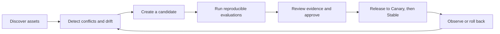

<div align="center">

# SkillOps

**Observe, evaluate, govern, and ship AI coding assets from one local control plane.**

Local-first. Git-backed. Evidence-driven. Built for Codex and Claude Code.

[English](README.md) | [简体中文](README.zh-CN.md)

[](https://github.com/Gjts/skillops/actions/workflows/ci.yml)
[](package.json)
[](LICENSE)
[](docs/develop/security/privacy-security.md)

</div>

<p align="center">
  
</p>
<p align="center"><sub>Synapse theme with the built-in synthetic demo dataset. No user telemetry is shown.</sub></p>

<p align="center">
  <a href="#why-skillops">Why SkillOps</a> |
  <a href="#what-ships-today">Capabilities</a> |
  <a href="#quick-start">Quick start</a> |
  <a href="#trust-boundaries">Trust</a> |
  <a href="#architecture">Architecture</a> |
  <a href="#documentation">Docs</a>
</p>

## Why SkillOps

AI coding runtimes can tell you what is configured. That does not prove which asset was active, whether a new version is better, who approved it, or whether a release can be rolled back safely.

SkillOps gives Skills, Prompts, Workflows, Rules, Agents, Evaluation Suites, and Policy Packs one local control plane with shared identity, evidence, lifecycle, and release semantics.



The result is a closed loop from runtime evidence to governed change, without turning prompts, source code, or credentials into telemetry.

## What ships today

| Surface | What it answers | Safety boundary |
| --- | --- | --- |
| **Overview and Runs** | Which Skills ran, where, for how long, at what reported cost, and with which known outcome? | Normalized metadata only; missing cost stays unreported and run history is server-paginated |
| **Registry and conflict center** | Which definitions are duplicated, disabled, shadowed, conflicting, or drifting? | Preview, exact Diff, backup, rescan, and undo |
| **Skill Lab and Managed Suites** | Is a candidate measurably better than its baseline? | Quick Compare stays in memory; persisted evidence is sanitized |
| **Governance** | Which immutable version has fresh evidence, independent approval, and a valid release target? | Candidate, Canary, Stable, deprecation, and rollback gates |
| **Prompt Registry** | Which committed Prompt version and component hashes are in use? | Git is authoritative; Prompt bodies stay behind the backend boundary |
| **Team control plane** | Who can approve, release, collect metadata, or apply a policy exception? | Local RBAC, scoped tokens, retention, and hash-chained audit |
| **Project templates** | Can a governed Team baseline be previewed, adopted, upgraded, and rolled back? | Review branch for migrations, exact hashes, no silent overwrite |

Artifact identities are kind-scoped. Immutable versions bind the exact Git commit when available and a deterministic SHA-256 content hash.

## Quick start

### Requirements

- Node.js `22.22.0` or newer
- Git
- A local Codex or Claude Code installation for runtime collection

### Install and preview

```bash
git clone https://github.com/Gjts/skillops.git
cd skillops
npm install

# Inspect exact config changes before writing anything
npm run codex:dry-run
npm run claude:dry-run
```

Install either or both native adapters:

```bash
npm run codex:install
npm run claude:install
```

The installers preserve unrelated runtime settings, redact credential-like preview values, create recoverable backups, and are idempotent.

Restart the runtime, inspect `/hooks`, trust the definitions when required, then start SkillOps:

```bash
npm run dev
```

Open [http://localhost:5173](http://localhost:5173). Run one real Skill invocation and confirm a non-discovery lifecycle event before treating the connection as verified.

Adapter details:

- [Codex installation, scope, privacy, and uninstall](adapters/codex/README.md)
- [Claude Code installation, scope, privacy, and uninstall](adapters/claude/README.md)
- [First-time user guide](docs/product/user-guide.md)

## Trust boundaries

SkillOps is local software, not a hosted telemetry service.

| Boundary | Guarantee |
| --- | --- |
| **Collection** | Events contain only allowlisted normalized metadata. Prompts, transcripts, tool payloads, tool outputs, source code, raw errors, and tokens are not persisted. |
| **Network** | The server binds to loopback and rejects non-loopback hosts. This release has no authenticated LAN or public deployment mode. |
| **Runtime safety** | Adapter failures are swallowed so telemetry cannot block Codex or Claude Code. Install and uninstall preserve unrelated hooks. |
| **Credentials** | AI settings are written only after an explicit save to `data/ai-settings.json`. Keys never enter events, exports, diagnostics, or evaluation evidence. |
| **Quick Compare** | Tasks, Skill bodies, workspace excerpts, outputs, and judge responses stay in browser memory. |
| **Managed evaluation** | Promptfoo runs in an isolated temporary environment with cache, telemetry, update checks, sharing, and remote generation disabled. Only sanitized summaries and hashes persist. |
| **Evidence semantics** | Discovery proves presence, not execution. A completed lifecycle with `outcome: unknown` is not counted as success. |
| **Release source** | Git commits and content hashes identify releasable assets. PromptHub cannot replace Stable or block offline rollback. |

Read the full [privacy and security model](docs/develop/security/privacy-security.md) before connecting a provider or collecting Team metadata.

## Runtime coverage

| Runtime | Status | Coverage |
| --- | --- | --- |
| **Codex** | Implemented | Native hooks, Skill and Workflow signals, Agents, sessions, tools, and bounded Desktop fallback ingestion |
| **Claude Code** | Implemented | Native lifecycle hooks, direct Skill commands, model-initiated Skill calls, Agents, tools, turns, and sessions |
| **Cursor** | Preview | Skill discovery and connection guidance only; no independent runtime adapter |

Rules are inventory-visible for Codex and Claude Code, but neither runtime currently exposes a trustworthy generic Rules execution lifecycle signal.

## Common commands

Run every command from the repository root.

| Goal | Command |
| --- | --- |
| Start development UI and API | `npm run dev` |
| Scan installed assets | `npm run scan` |
| Build and run the loopback production server | `npm run build && npm start` |
| Run automated tests | `npm test` |
| Run the production smoke scenario | `npm run smoke` |
| Check Markdown links | `npm run docs:check` |
| List Managed Suites | `npm run eval:list` |
| Run a Managed Suite | `npm run eval:run -- --suite <id> --baseline <ref> --candidate <ref> --provider <id>` |
| Verify stored evidence | `npm run eval:verify -- --run <run-id>` |
| Preview a Team Template | `npm run template:init -- --manifest <file> --target <project> --mode <mode>` |
| Uninstall adapters | `npm run codex:uninstall` or `npm run claude:uninstall` |

Production runs at [http://localhost:4173](http://localhost:4173). `SKILLOPS_DATA_DIR` moves local state outside the default `data/` directory.

## Architecture

```text
app/
  backend/             Loopback API, event store, scanning, evaluation, governance
  frontend/skillops/   React and Vite product UI
  shared/              Cross-layer event and evaluation contracts
adapters/               Codex and Claude Code hook adapters
bin/                    SkillOps CLI
evals/                  Reviewed Suites, policies, and sanitized datasets
docs/                   Product, architecture, operations, and security source of truth
scripts/                Smoke and verification helpers
data/                   Generated local state, ignored by Git
```

The frontend calls the local HTTP API and never reads runtime files directly. Backend modules own filesystem, process, Git, and credential integration. The repository remains one npm package.

Start with the [system architecture](docs/develop/architecture/system_architecture.md) and [architecture decisions](docs/develop/architecture/decisions.md) before changing module boundaries.

## Documentation

| Reader | Start here |
| --- | --- |
| First-time operator | [User guide](docs/product/user-guide.md) |
| Product or UX contributor | [Product requirements](docs/product/prd.md) |
| Runtime integrator | [Runtime adapter contract](docs/develop/integrations/runtime_adapters.md) |
| Evaluation author | [Promptfoo integration contract](docs/develop/integrations/promptfoo.md) |
| Prompt contributor | [Local Prompt Registry contract](docs/develop/integrations/prompt-registry.md) |
| Event producer | [Event model](docs/develop/data/event_model.md) |
| Security reviewer | [Privacy and security](docs/develop/security/privacy-security.md) |
| Maintainer | [Complete documentation map](docs/README.md) |

## Current scope and known limits

- Product state: local + Git release candidate.
- PromptHub v1 is a read connector. It can list and diff remote versions, but cannot publish, promote, or provide the unsupported push-only and bidirectional modes.
- Team mode remains local. SaaS tenancy, authenticated network deployment, SSO, and SCIM are deferred.
- The pinned Promptfoo dependency inherits known transitive `npm audit` advisories. Isolation reduces exposure but does not remove dependency risk. See the [dated advisory and upgrade contract](docs/develop/integrations/promptfoo.md#known-dependency-advisory).
- A discovered asset is not evidence that it ran. A real non-discovery lifecycle event is required for runtime verification.

## Contributing

Before changing behavior:

1. Read [AGENTS.md](AGENTS.md) and the relevant architecture or adapter document.
2. Reuse the existing module boundary and privacy allowlist.
3. Run the narrowest relevant test, then `npm test`, `npm run build`, and `npm run smoke` when server, routing, or API behavior changed.
4. Run `npm run docs:check` and `git diff --check` before preparing a commit.
5. Follow the [commit convention](docs/commit-convention.md).

## License

[MIT](LICENSE) © 2026 Gjts
