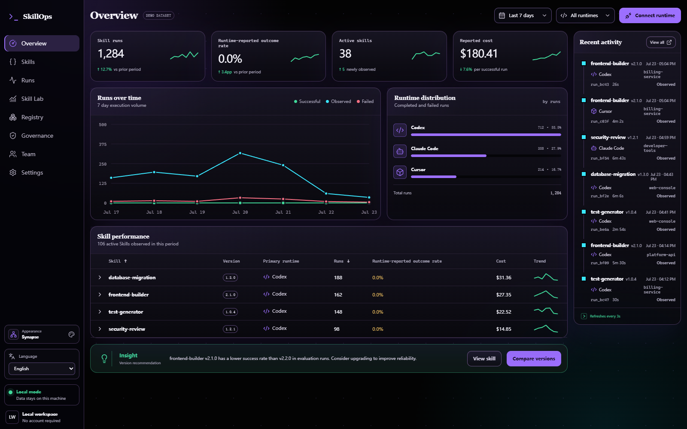
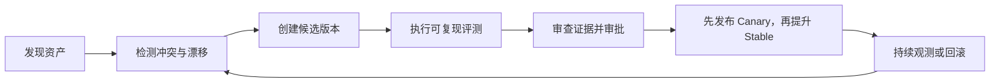

<div align="center">

# SkillOps

**在一个本地控制平面中观测、评测、治理并发布 AI 编程资产。**

本地优先。Git 支撑。证据驱动。面向 Codex 与 Claude Code。

[English](README.md) | [简体中文](README.zh-CN.md)

[](https://github.com/Gjts/skillops/actions/workflows/ci.yml)
[](package.json)
[](LICENSE)
[](docs/develop/security/privacy-security.md)

</div>

<p align="center">
  
</p>
<p align="center"><sub>Synapse 主题与内置合成演示数据集。截图不包含用户遥测。</sub></p>

<p align="center">
  <a href="#why-skillops">为什么选择 SkillOps</a> |
  <a href="#capabilities">当前能力</a> |
  <a href="#quick-start">快速开始</a> |
  <a href="#trust-boundaries">信任边界</a> |
  <a href="#architecture">架构</a> |
  <a href="#documentation">文档</a>
</p>

<a id="why-skillops"></a>
## 为什么选择 SkillOps

AI 编程 Runtime 能说明配置了什么，却不能证明实际生效的是哪个资产、新版本是否更好、由谁审批，或发布失败后能否安全回滚。

SkillOps 将 Skill、Prompt、Workflow、Rules、Agent、Evaluation Suite 和 Policy Pack 纳入同一个本地控制平面，共享身份、证据、生命周期和发布语义。



这形成了从 Runtime 证据到受治理变更的完整闭环，同时不会把 Prompt、源代码或凭据变成遥测。

<a id="capabilities"></a>
## 当前已实现

| 界面 | 能回答的问题 | 安全边界 |
| --- | --- | --- |
| **Overview 与 Runs** | 哪些 Skill 在哪里运行、耗时多久、报告了多少成本、结果是否已知？ | 仅归一化元数据 |
| **Registry 与冲突中心** | 哪些定义重复、禁用、被遮蔽、冲突或发生漂移？ | 预览、精确 Diff、备份、重扫与撤销 |
| **Skill Lab 与 Managed Suites** | 候选版本是否可测量地优于基线？ | Quick Compare 仅驻留内存，持久证据均已清洗 |
| **Governance** | 哪个不可变版本具备新鲜证据、独立审批和有效发布目标？ | Candidate、Canary、Stable、弃用与回滚门禁 |
| **Prompt Registry** | 当前使用了哪个已提交 Prompt 版本及组件哈希？ | Git 是事实源，Prompt 正文不会越过后端边界 |
| **Team 控制平面** | 谁能审批、发布、收集元数据或批准策略例外？ | 本地 RBAC、最小权限令牌、保留策略与哈希链审计 |
| **项目模板** | 受治理的团队基线能否预览、采用、升级和回滚？ | 迁移使用审查分支、精确哈希、不静默覆盖 |

Artifact 身份按种类隔离。不可变版本在可用时绑定精确 Git commit，并包含确定性的 SHA-256 内容哈希。

<a id="quick-start"></a>
## 快速开始

### 环境要求

- Node.js `22.22.0` 或更高版本
- Git
- 如需采集 Runtime 生命周期，需要本地安装 Codex 或 Claude Code

### 安装并预览

```bash
git clone https://github.com/Gjts/skillops.git
cd skillops
npm install

# 写入任何配置前，先检查精确变更
npm run codex:dry-run
npm run claude:dry-run
```

按需安装一个或两个原生适配器：

```bash
npm run codex:install
npm run claude:install
```

安装器会保留无关 Runtime 设置、隐藏预览中的凭据类值、创建可恢复备份，并保证重复执行幂等。

重启 Runtime，检查 `/hooks`，在需要时信任新定义，然后启动 SkillOps：

```bash
npm run dev
```

打开 [http://localhost:5173](http://localhost:5173)。真实调用一次 Skill，并确认出现非 discovery 生命周期事件后，才能将连接视为已验证。

适配器详情：

- [Codex 安装、作用域、隐私与卸载](adapters/codex/README.md)
- [Claude Code 安装、作用域、隐私与卸载](adapters/claude/README.md)
- [首次使用指南](docs/product/user-guide.md)

<a id="trust-boundaries"></a>
## 信任边界

SkillOps 是本地软件，不是托管遥测服务。

| 边界 | 保证 |
| --- | --- |
| **采集** | 事件仅允许归一化元数据。Prompt、Transcript、工具输入输出、源代码、原始错误和 Token 均不持久化。 |
| **网络** | 服务仅绑定 Loopback，并拒绝非 Loopback Host。当前版本不提供带认证的局域网或公网部署模式。 |
| **Runtime 安全** | 适配器会吞掉遥测失败，因此不会阻塞 Codex 或 Claude Code。安装和卸载均保留无关 Hook。 |
| **凭据** | 仅在用户显式保存后，AI 设置才写入 `data/ai-settings.json`。Key 不进入事件、导出、诊断或评测证据。 |
| **Quick Compare** | 任务、Skill 正文、Workspace 摘录、输出和 Judge 响应只驻留浏览器内存。 |
| **Managed Evaluation** | Promptfoo 在隔离临时环境中运行，缓存、遥测、更新检查、分享和远程生成均被禁用。仅持久化清洗后的摘要和哈希。 |
| **证据语义** | Discovery 只证明存在，不证明执行。`outcome: unknown` 的完成生命周期不会计为成功。 |
| **发布事实源** | Git commit 与内容哈希标识可发布资产。PromptHub 不能替换 Stable，也不能阻止离线回滚。 |

连接模型供应商或采集团队元数据前，请阅读完整的[隐私与安全模型](docs/develop/security/privacy-security.md)。

## Runtime 覆盖

| Runtime | 状态 | 覆盖范围 |
| --- | --- | --- |
| **Codex** | 已实现 | 原生 Hook、Skill 与 Workflow 信号、Agent、Session、工具及受限的 Desktop 回退采集 |
| **Claude Code** | 已实现 | 原生生命周期 Hook、直接 Skill 命令、模型发起的 Skill 调用、Agent、工具、Turn 与 Session |
| **Cursor** | Preview | Skill 发现和连接指引，不提供独立 Runtime 适配器 |

Codex 与 Claude Code 中的 Rules 可在资产清单中发现，但两者目前都没有提供可信的通用 Rules 执行生命周期信号。

## 常用命令

所有命令均从仓库根目录运行。

| 目标 | 命令 |
| --- | --- |
| 启动开发 UI 与 API | `npm run dev` |
| 扫描已安装资产 | `npm run scan` |
| 构建并运行 Loopback 生产服务 | `npm run build && npm start` |
| 运行自动化测试 | `npm test` |
| 运行生产 Smoke 场景 | `npm run smoke` |
| 检查 Markdown 链接 | `npm run docs:check` |
| 列出 Managed Suites | `npm run eval:list` |
| 运行 Managed Suite | `npm run eval:run -- --suite <id> --baseline <ref> --candidate <ref> --provider <id>` |
| 验证已存储证据 | `npm run eval:verify -- --run <run-id>` |
| 预览 Team Template | `npm run template:init -- --manifest <file> --target <project> --mode <mode>` |
| 卸载适配器 | `npm run codex:uninstall` 或 `npm run claude:uninstall` |

生产服务运行于 [http://localhost:4173](http://localhost:4173)。通过 `SKILLOPS_DATA_DIR` 可将本地状态移出默认 `data/` 目录。

<a id="architecture"></a>
## 架构

```text
app/
  backend/             Loopback API、事件存储、扫描、评测与治理
  frontend/skillops/   React 与 Vite 产品界面
  shared/              跨层事件和评测契约
adapters/               Codex 与 Claude Code Hook 适配器
bin/                    SkillOps CLI
evals/                  已审查 Suite、Policy 和清洗数据集
docs/                   产品、架构、运维与安全事实源
scripts/                Smoke 与验证辅助脚本
data/                   Git 忽略的本地生成状态
```

前端只调用本地 HTTP API，不直接读取 Runtime 文件。后端模块负责文件系统、进程、Git 和凭据集成。整个仓库保持为单一 npm package。

修改模块边界前，请先阅读[系统架构](docs/develop/architecture/system_architecture.md)与[架构决策](docs/develop/architecture/decisions.md)。

<a id="documentation"></a>
## 文档

| 读者 | 从这里开始 |
| --- | --- |
| 首次使用者 | [用户指南](docs/product/user-guide.md) |
| 产品或 UX 贡献者 | [产品需求](docs/product/prd.md) |
| Runtime 集成者 | [Runtime 适配器契约](docs/develop/integrations/runtime_adapters.md) |
| 评测作者 | [Promptfoo 集成契约](docs/develop/integrations/promptfoo.md) |
| Prompt 贡献者 | [本地 Prompt Registry 契约](docs/develop/integrations/prompt-registry.md) |
| 事件生产者 | [事件模型](docs/develop/data/event_model.md) |
| 安全审查者 | [隐私与安全](docs/develop/security/privacy-security.md) |
| 维护者 | [完整文档地图](docs/README.md) |

## 当前范围与已知限制

- 产品状态：本地 + Git 发布候选版本。
- PromptHub v1 是只读 Connector。它可以列出和 Diff 远程版本，但不能发布、提升，也不提供未受支持的 push-only 和双向模式。
- Team 模式仍为本地模式。SaaS 租户、带认证的网络部署、SSO 与 SCIM 均已延后。
- 固定版本的 Promptfoo 依赖继承了已知的传递性 `npm audit` 风险。隔离降低了暴露面，但不会消除依赖风险。参见[带日期的风险说明与升级契约](docs/develop/integrations/promptfoo.md#known-dependency-advisory)。
- 发现资产不等于资产已运行。验证 Runtime 必须看到真实的非 discovery 生命周期事件。

## 参与贡献

修改行为前：

1. 阅读 [AGENTS.md](AGENTS.md) 以及相关架构或适配器文档。
2. 复用现有模块边界和隐私字段白名单。
3. 先运行最窄相关测试；当服务、路由或 API 行为变化时，再运行 `npm test`、`npm run build` 与 `npm run smoke`。
4. 准备提交前运行 `npm run docs:check` 与 `git diff --check`。
5. 遵循[提交规范](docs/commit-convention.md)。

## 许可证

[MIT](LICENSE) © 2026 Gjts
