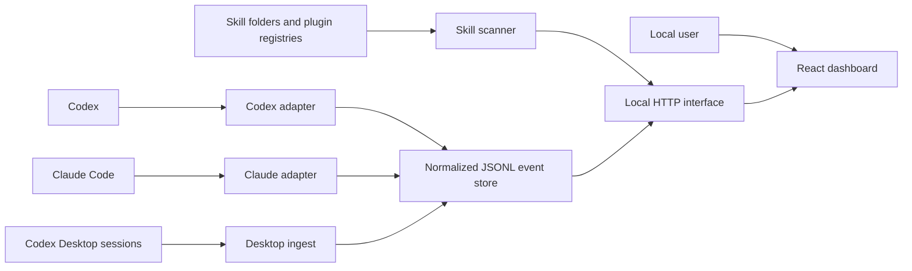

# System architecture: SkillOps

> Version: v0.3.1
> Status: implemented architecture

## 1. Architectural goal

SkillOps keeps runtime-specific collection and local filesystem complexity
behind a small normalized event interface. The UI consumes only local HTTP and
shared event semantics. A maintainer can change a hook adapter, scanner source,
or event-store implementation without teaching the frontend those details.

## 2. System context



All arrows remain on the user's machine in v0.3.1.

## 3. Repository modules

| Module | Interface | Implementation responsibility |
| --- | --- | --- |
| `app/frontend/skillops` | Local HTTP responses and shared event types | Routing, rendering, filtering, analytics, import/export UX |
| `app/backend` | Event, scan, connection, and static-file behavior | JSONL persistence, scanning, desktop ingestion, config inspection |
| `app/shared` | `normalizeEvent(s)` invariants | Event allowlist, types, enums, outcome normalization |
| `adapters/codex` | Codex hook payload to normalized events | Install merge, signal detection, non-blocking hook execution |
| `adapters/claude` | Claude hook payload to normalized events | Config resolution, install merge, exact/heuristic detection |
| `bin` | Root npm CLI commands | Scan plus manual lifecycle emission |
| `scripts` | Operator verification commands | Smoke and real-recording checks |

## 4. Dependency direction

```text
app/frontend/skillops ──local HTTP──► app/backend ──► app/shared
                                           ▲
adapters/codex ─────────────────────────────┤
adapters/claude ────────────────────────────┤
bin ────────────────────────────────────────┘
```

Rules:

- frontend code does not import backend implementation or read runtime files;
- backend code owns all filesystem/process integration;
- adapter code translates external runtime payloads and reuses the backend
  event-store interface;
- shared code contains only invariants used on both browser and Node paths;
- CLI and scripts reuse existing modules instead of cloning validation/scanning.

## 5. Primary flows

### 5.1 Live hook ingestion

```text
Runtime hook signal
  → runtime adapter parses privacy-minimized metadata
  → shared normalization validates and discards unknown fields
  → event store appends one JSONL record
  → GET /api/events returns the local history
  → frontend recomputes visible metrics
```

Telemetry errors are swallowed at the runtime-adapter edge so a collection
failure cannot block Codex or Claude Code.

### 5.2 Codex Desktop fallback ingestion

```text
GET /api/events or GET /api/connections
  → inspect recent Codex session JSONL files
  → accept desktop/vscode session sources only
  → detect actual SKILL.md read commands
  → generate stable normalized events
  → deduplicate against existing semantic keys
  → append new records
```

This is incremental and bounded by lookback/file limits. It is not a general
transcript importer.

### 5.3 Inventory scan

```text
Registry opens or user clicks Scan again
  → POST /api/scan
  → scanner resolves runtime homes and plugin registries
  → recursively finds SKILL.md and legacy command Markdown
  → reads frontmatter metadata
  → returns definitions without writing execution evidence
```

The CLI `npm run scan` additionally appends new `skill.discovered` events using
a deduplicated discovery index.

### 5.4 Runtime connection inspection

```text
GET /api/connections
  → resolve effective Codex/Claude config
  → find SkillOps-marked handlers
  → verify every referenced absolute .mjs path exists
  → combine config status with non-discovery activity count
```

Historical events do not determine installation status.

## 6. Local HTTP interface

| Method | Path | Purpose |
| --- | --- | --- |
| `GET` | `/api/events` | Read events; supports `If-None-Match` and `304` |
| `POST` | `/api/events` | Validate and append one event |
| `DELETE` | `/api/events` | Back up and clear active events |
| `POST` | `/api/import` | Atomically validate/deduplicate/append an event array |
| `POST` | `/api/scan` | Return live installed definitions |
| `GET` | `/api/connections` | Return runtime config status and activity |

The Vite development middleware and production Node server implement the same
application interface. Changes must be kept behaviorally aligned.

## 7. Runtime and deployment model

SkillOps is one npm package and one local deployment unit. Root configuration is
intentional:

- `package.json` is the command/dependency interface;
- TypeScript project references cover the frontend build;
- Vite uses `app/frontend/skillops` as its root;
- production assets are written to root `dist/`;
- `app/backend/server.mjs` serves the SPA and local HTTP interface.

Creating separate frontend/backend packages would add manifest and release
interfaces without independent deployment needs.

## 8. State ownership

| State | Owner | Persistence |
| --- | --- | --- |
| Normalized events | Backend event store | `data/events.jsonl` or `SKILLOPS_DATA_DIR` |
| Discovery keys | Backend event store | `data/discovery-index.json` |
| Runtime hook configuration | Host runtime | Codex/Claude config files |
| Filter, page, modal state | Frontend | In-memory; page identity also in URL |
| Demo dataset | Frontend | In-memory only when local event API is unavailable |
| Production frontend | Build | `dist/`, ignored by Git |

## 9. Trust seams

- **Runtime payload seam**: adapters accept untrusted host payload shapes and
  emit only allowlisted metadata.
- **Import seam**: the complete JSON/JSONL batch is normalized before append.
- **Filesystem seam**: the scanner tolerates missing/inaccessible conventional
  directories and prevents recursion loops through canonical paths.
- **HTTP seam**: the interface is unauthenticated and therefore loopback-only by
  default.
- **Configuration seam**: installers preserve unrelated values and identify
  their handlers with explicit markers.

## 10. Change placement guide

| Change | Primary location |
| --- | --- |
| Add or restrict an event field | `app/shared/event-schema.mjs` plus event-model docs/tests |
| Add a local HTTP operation | backend server + Vite middleware + interface tests/docs |
| Add a runtime signal | relevant adapter; shared schema only if new metadata is needed |
| Add a scan location | backend scanner and scanner tests |
| Change metric semantics | frontend analytics module and tests |
| Change connection truth rules | backend runtime-connections and adapter config helpers |
| Add an independent runtime | new adapter only when a real runtime interface exists |

## 11. Architecture verification

Run after structural or cross-module work:

```powershell
npm test
npm run build
npm run smoke
git diff --check
```

If adapter absolute paths changed, reinstall the affected adapter and verify
`GET /api/connections` plus one real non-discovery event.
