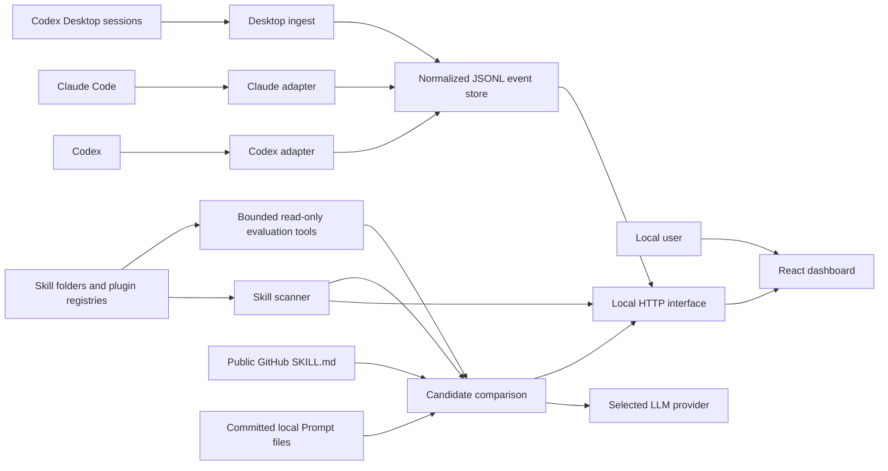

# System architecture: SkillOps

> Version: v0.3.1
> Status: implemented architecture

## 1. Architectural goal

SkillOps keeps runtime-specific collection and local filesystem complexity
behind a small normalized event interface. The UI consumes only local HTTP and
shared event semantics. A maintainer can change a hook adapter, scanner source,
or event-store implementation without teaching the frontend those details.

## 2. System context



Telemetry, inventory, and event-store arrows remain on the user's machine.
Skill Lab adds two explicit user-initiated network boundaries: reading a public
GitHub candidate and sending an evaluation/chat request to the configured LLM
provider. Prompts and model output are not written to disk. AI provider
settings may be saved to local `data/ai-settings.json` after an explicit Save.

## 3. Repository modules

| Module | Interface | Implementation responsibility |
| --- | --- | --- |
| `app/frontend/skillops` | Local HTTP responses, shared event types, provider catalog | Routing, rendering, filtering, analytics, import/export, Skill Lab and API-backed AI settings |
| `app/backend` | Event, scan, connection, evaluation, and static-file behavior | JSONL persistence, AI settings file IO, scanning, desktop ingestion, config inspection, candidate comparison, bounded read-only agent tools, provider calls, and evaluation adapters |
| `app/shared` | Event and Evaluation Schema invariants plus AI provider catalog | Event allowlist/types/enums/outcome normalization, narrow evaluation request/Artifact contracts, and provider identity/default metadata shared by frontend and backend |
| `adapters/codex` | Codex hook payload to normalized events | Install merge, signal detection, non-blocking hook execution |
| `adapters/claude` | Claude hook payload to normalized events | Config resolution, install merge, exact/heuristic detection |
| `bin` | Root npm CLI commands | Scan plus manual lifecycle emission |
| `scripts` | Operator verification commands | Smoke and real-recording checks |

## 4. Dependency direction

```text
app/frontend/skillops ──local HTTP──► app/backend ──► app/shared
                                           ▲
adapters/codex ─────────────────────────────┤
adapters/claude ────────────────────────────┤
bin ────────────────────────────────────────┘
```

Rules:

- frontend code does not import backend implementation or read runtime files;
- backend code owns all filesystem/process integration;
- adapter code translates external runtime payloads and reuses the backend
  event-store interface;
- shared code contains only invariants used on both browser and Node paths;
- CLI and scripts reuse existing modules instead of cloning validation/scanning.

## 5. Primary flows

### 5.1 Live hook ingestion

```text
Runtime hook signal
  → runtime adapter parses privacy-minimized metadata
  → shared normalization validates and discards unknown fields
  → event store appends one JSONL record
  → GET /api/events returns the local history
  → frontend recomputes visible metrics
```

Telemetry errors are swallowed at the runtime-adapter edge so a collection
failure cannot block Codex or Claude Code.

### 5.2 Codex Desktop fallback ingestion

```text
GET /api/events or GET /api/connections
  → inspect recent Codex session JSONL files
  → accept desktop/vscode session sources only
  → detect actual SKILL.md read commands
  → generate stable normalized events
  → deduplicate against existing semantic keys
  → append new records
```

This is incremental and bounded by lookback/file limits. It is not a general
transcript importer.

### 5.3 Inventory scan

```text
Registry opens or user clicks Scan again
  → POST /api/scan
  → scanner resolves runtime homes and plugin registries
  → recursively finds SKILL.md and legacy command Markdown
  → reads frontmatter metadata
  → returns definitions without writing execution evidence
```

The CLI `npm run scan` additionally appends new `skill.discovered` events using
a deduplicated discovery index.

### 5.4 Runtime connection inspection

```text
GET /api/connections
  → resolve effective Codex/Claude config
  → find SkillOps-marked handlers
  → verify every referenced absolute .mjs path exists
  → combine config status with non-discovery activity count
```

Historical events do not determine installation status.

### 5.5 Candidate comparison and A/B evaluation

```text
User submits public GitHub URL
  → backend discovers bounded SKILL.md candidates
  → selected candidate is compared with enabled local definitions
  → browser selects an allowlisted scanned path as baseline
  → backend re-downloads the candidate and verifies its analyzed SHA-256 hash
  → backend runs both definitions sequentially in the selected mode
      prompt-only: one provider call per definition, no workspace access
      agent: bounded allowlisted list/read/search workspace tools
  → third provider call judges anonymous Answer A / Answer B
  → result remains in browser memory; no Skill or runtime config is changed
```

The frontend never requests arbitrary local files. The backend accepts a
baseline only when the exact path is present in the current live scan.

`app/backend/skill-evaluations.mjs` is the compatibility facade at the existing
interface. Its implementation delegates to deep modules under
`app/backend/evaluations/`: request guard, candidate-source adapter, Artifact
definition/renderer, provider client, and session evaluator. GitHub is the
Skill Candidate adapter; `app/backend/prompts/` is the Git-backed Prompt
Artifact adapter rather than pretending Prompt content is a `SKILL.md`.

Artifact content hashes use UTF-8 bytes after BOM removal and CRLF/CR to LF
normalization. Metadata may cross the local HTTP seam, while the content body
stays inside a controlled backend renderer.

## 6. Local HTTP interface

| Method | Path | Purpose |
| --- | --- | --- |
| `GET` | `/api/events` | Read events; supports `If-None-Match` and `304` |
| `POST` | `/api/events` | Validate and append one event |
| `DELETE` | `/api/events` | Back up and clear active events |
| `POST` | `/api/import` | Atomically validate/deduplicate/append an event array |
| `POST` | `/api/scan` | Return live installed definitions |
| `GET` | `/api/connections` | Return runtime config status and activity |
| `POST` | `/api/evaluations/compare` | Discover a public GitHub candidate and rank local overlaps |
| `POST` | `/api/evaluations/run` | Run a hash-pinned, memory-only baseline/candidate A/B evaluation |
| `GET` | `/api/evaluation-suites` | List validated Suite Schema v1 metadata |
| `POST` | `/api/evaluation-runs` | Queue a hash-pinned Managed Suite run |
| `GET` | `/api/evaluation-runs/:id` | Read sanitized run evidence and cases |
| `POST` | `/api/evaluation-runs/:id/cancel` | Request cooperative cancellation |
| `GET/POST` | `/api/capabilities/*` | Registry, evidence, gate, approval, promotion, and rollback operations |
| `GET` | `/api/project-skeleton-lock` | Read the current immutable promotion/rollback lock |
| `GET` | `/api/prompt-registry/status` | Return local Git workspace, branch, commit, and persistence metadata |
| `POST` | `/api/prompt-registry/{prompts,compare,nominate}` | Metadata-only committed Prompt browsing, component Diff, and explicit Candidate nomination |
| `POST` | `/api/assistant/chat` | Ask the configured provider using inventory/evaluation metadata |
| `GET` | `/api/ai-settings` | Load saved Skill Lab AI provider settings |
| `PUT` | `/api/ai-settings` | Persist Skill Lab AI provider settings locally |

The Vite development middleware and production Node server implement the same
application interface. Changes must be kept behaviorally aligned.

## 7. Runtime and deployment model

SkillOps is one npm package and one local deployment unit. Root configuration is
intentional:

- `package.json` is the command/dependency interface;
- TypeScript project references cover the frontend build;
- Vite uses `app/frontend/skillops` as its root;
- production assets are written to root `dist/`;
- `app/backend/server.mjs` serves the SPA and local HTTP interface.

Creating separate frontend/backend packages would add manifest and release
interfaces without independent deployment needs.

## 8. State ownership

| State | Owner | Persistence |
| --- | --- | --- |
| Normalized events | Backend event store | `data/events.jsonl` or `SKILLOPS_DATA_DIR` |
| Discovery keys | Backend event store | `data/discovery-index.json` |
| Runtime hook configuration | Host runtime | Codex/Claude config files |
| Filter, page, modal state | Frontend | In-memory; page identity also in URL |
| AI provider settings and API key | Backend AI settings store | `data/ai-settings.json` after explicit Save; loaded by Evaluations on mount |
| Evaluation task, outputs, and chat | Frontend | In-memory only |
| Managed run/case summaries and identity hashes | Backend evidence store | `data/evidence/`; sanitized JSONL and indexes |
| Capability, approval, promotion, and rollback metadata | Backend governance store | `data/governance/`; metadata and hashes only |
| Stable installation locks and backups | Backend skeleton installer | Local target lock plus recoverable backup |
| Prompt bodies | User Git repository/backend resolver | User-controlled source plus transient evaluation memory; never copied into SkillOps data |
| Demo dataset | Frontend | In-memory only when local event API is unavailable |
| Production frontend | Build | `dist/`, ignored by Git |

## 9. Trust seams

- **Runtime payload seam**: adapters accept untrusted host payload shapes and
  emit only allowlisted metadata.
- **Import seam**: the complete JSON/JSONL batch is normalized before append.
- **Filesystem seam**: the scanner tolerates missing/inaccessible conventional
  directories and prevents recursion loops through canonical paths.
- **HTTP seam**: the interface is unauthenticated and therefore loopback-only by
  default. Evaluation POSTs additionally require a loopback Host, same-origin
  browser request when Origin is present, and `application/json`.
- **Candidate network seam**: only public `github.com` and
  `raw.githubusercontent.com` HTTPS locations are accepted; downloaded Skill
  files and repository-tree responses are size/count bounded.
- **Prompt Registry seam**: only committed files under the configured
  repository-relative Prompt directory are eligible; revision and path syntax,
  file count/size, Schema fields, variables, and model configuration are
  bounded. The UI receives only metadata and component hashes, and immutable
  identity is verified again before execution and promotion.
- **Evaluation engine seam**: a restricted declarative Suite is compiled in
  memory for an isolated Promptfoo Worker. Executable config, output paths,
  caller environment, cache, telemetry, sharing, and remote generation are
  prohibited.
- **Provider network seam**: a user-selected HTTPS endpoint receives the
  in-memory key and requested prompt; keyless Ollama HTTP is loopback-only.
  Provider responses are never persisted by SkillOps. Credentials are persisted
  only after explicit Save and only in local `data/ai-settings.json`.
- **Evaluation-agent seam**: prompt-only runs have no workspace access. Agent
  runs can list/search/read bounded allowed text, deny hidden/common secret,
  runtime, dependency/build paths and symlinks, redact credential-like lines,
  and expose no write/process/network tool.
- **Configuration seam**: installers preserve unrelated values and identify
  their handlers with explicit markers.

## 10. Change placement guide

| Change | Primary location |
| --- | --- |
| Add or restrict an event field | `app/shared/event-schema.mjs` plus event-model docs/tests |
| Add a local HTTP operation | backend server + Vite middleware + interface tests/docs |
| Add a runtime signal | relevant adapter; shared schema only if new metadata is needed |
| Add a scan location | backend scanner and scanner tests |
| Change metric semantics | frontend analytics module and tests |
| Change connection truth rules | backend runtime-connections and adapter config helpers |
| Add an independent runtime | new adapter only when a real runtime interface exists |

## 11. Architecture verification

Run after structural or cross-module work:

```powershell
npm test
npm run build
npm run smoke
git diff --check
```

If adapter absolute paths changed, reinstall the affected adapter and verify
`GET /api/connections` plus one real non-discovery event.
