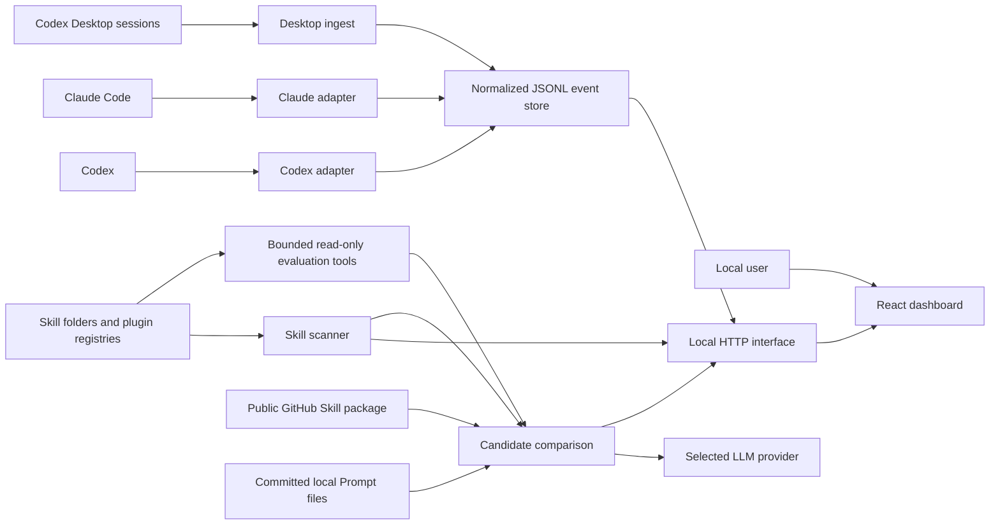

# System architecture: SkillOps

> Version: v0.3.2-rc.1
> Status: implemented architecture

## 1. Architectural goal

SkillOps keeps runtime-specific collection and local filesystem complexity
behind a small normalized event interface. The UI consumes only local HTTP and
shared event semantics. A maintainer can change a hook adapter, scanner source,
or event-store implementation without teaching the frontend those details.

## 2. System context



Telemetry, inventory, and event-store arrows remain on the user's machine.
Skill Lab adds two explicit user-initiated network boundaries: reading a public
GitHub candidate and sending an evaluation/chat request to the configured LLM
provider. Prompts and model output are not written to disk. AI provider
settings may be saved to local `data/ai-settings.json` after an explicit Save.

## 3. Repository modules

| Module | Interface | Implementation responsibility |
| --- | --- | --- |
| `app/frontend/skillops` | Local HTTP responses, shared event types, provider catalog | Routing, rendering, filtering, analytics, import/export, Skill Lab and API-backed AI settings |
| `app/backend` | Event, scan, connection, evaluation, and static-file behavior | JSONL persistence, AI settings file IO, scanning, desktop ingestion, config inspection, candidate comparison, bounded read-only agent tools, provider calls, and evaluation adapters |
| `app/shared` | Event and Evaluation Schema invariants plus AI provider catalog | Event allowlist/types/enums/outcome normalization, narrow evaluation request/Artifact contracts, and provider identity/default metadata shared by frontend and backend |
| `adapters/codex` | Codex hook payload to normalized events | Install merge, signal detection, non-blocking hook execution |
| `adapters/claude` | Claude hook payload to normalized events | Config resolution, install merge, exact/heuristic detection |
| `bin` | Root npm CLI commands | Scan, manual lifecycle emission, Managed Suite execution, and governed Team project-template preview/apply/status/rollback |
| `scripts` | Operator verification commands | Smoke and real-recording checks |

## 4. Dependency direction

```text
app/frontend/skillops ──local HTTP──► app/backend ──► app/shared
                                           ▲
adapters/codex ─────────────────────────────┤
adapters/claude ────────────────────────────┤
bin ────────────────────────────────────────┘
```

Rules:

- frontend code does not import backend implementation or read runtime files;
- backend code owns all filesystem/process integration;
- adapter code translates external runtime payloads and reuses the backend
  event-store interface;
- shared code contains only invariants used on both browser and Node paths;
- CLI and scripts reuse existing modules instead of cloning validation/scanning.

## 5. Primary flows

### 5.1 Live hook ingestion

```text
Runtime hook signal
  → runtime adapter parses privacy-minimized metadata
  → shared normalization validates and discards unknown fields
  → event store appends one JSONL record
  → GET /api/events returns the local history
  → frontend recomputes visible metrics
```

Telemetry errors are swallowed at the runtime-adapter edge so a collection
failure cannot block Codex or Claude Code.

### 5.2 Codex Desktop fallback ingestion

```text
GET /api/events or GET /api/connections
  → inspect recent Codex session JSONL files
  → accept desktop/vscode session sources only
  → detect actual SKILL.md read commands
  → generate stable normalized events
  → deduplicate against existing semantic keys
  → append new records
```

This is incremental and bounded by lookback/file limits. It is not a general
transcript importer.

### 5.3 Inventory scan

```text
Registry opens or user clicks Scan again
  → POST /api/scan
  → scanner resolves runtime homes and plugin registries
  → recursively finds SKILL.md and legacy command Markdown
  → reads frontmatter metadata, effective file-based enablement and normalized content hashes
  → returns definitions without writing execution evidence
```

The CLI `npm run scan` additionally appends new `skill.discovered` events using
a deduplicated discovery index.

### 5.4 Runtime connection inspection

```text
GET /api/connections
  → resolve effective Codex/Claude config
  → find SkillOps-marked handlers
  → verify every referenced absolute .mjs path exists
  → combine config status with non-discovery activity count
```

Historical events do not determine installation status.

### 5.5 Candidate comparison and A/B evaluation

```text
User submits public GitHub URL
  → backend discovers bounded SKILL.md candidates
  → selected candidate is compared with enabled local definitions
  → browser selects an allowlisted scanned path as baseline
  → backend re-downloads the candidate and verifies its analyzed SHA-256 hash
  → backend runs both definitions sequentially in the selected mode
      prompt-only: one provider call per definition, no workspace access
      agent: bounded allowlisted list/read/search workspace tools
  → third provider call judges anonymous Answer A / Answer B
  → result remains in browser memory; no Skill or runtime config is changed
```

The frontend never requests arbitrary local files. The backend accepts a
baseline only when the exact path is present in the current live scan.

`app/backend/skill-evaluations.mjs` is the compatibility facade at the existing
interface. Its implementation delegates to deep modules under
`app/backend/evaluations/`: request guard, candidate-source adapter, Artifact
definition/renderer, provider client, and session evaluator. GitHub is the
Skill Candidate adapter; `app/backend/prompts/` is the Git-backed Prompt
Artifact adapter rather than pretending Prompt content is a `SKILL.md`.

Artifact content hashes use UTF-8 bytes after BOM removal and CRLF/CR to LF
normalization. Metadata may cross the local HTTP seam, while the content body
stays inside a controlled backend renderer.

### 5.6 Unified Artifact Registry

```text
GET /api/artifacts
  → rescan installed Skill and legacy command definitions
  → read committed Prompt metadata, governance capabilities, and project locks
  → normalize kind-scoped Artifact and immutable ArtifactVersion identities
  → compare desired lock state with observed paths and content hashes
  → return metadata, compatibility, dependencies, and drift only
```

`app/backend/evaluations/artifact-registry.mjs` is a derived read model behind
the `app/backend/skill-evaluations.mjs` compatibility facade, not another
content store. Skill/command files and Prompt bodies remain with their owning
scanner or Git resolver. GitHub Candidate preview resolves the requested branch
or tag to an exact commit before download, preserves its encoded candidate path
for later resolution, and returns no body. The optional legacy migration is a
separate preview/apply/rollback workflow. It accepts only the schema-versioned
legacy scan allowlist and rejects unknown preimages. Only the newest preview is
retained and it expires after ten minutes. Apply uses one process-shared file
lock, verifies the previewed preimage hash, writes atomically, records and
validates the post-write snapshot hash on every read, and retains an exact-byte
backup when replacing an existing file.

The migrated snapshot is read only as compatibility history: versions absent
from current sources reappear as Deprecated, current source records always win,
and installation state is always recomputed from the live scan and lock.

### 5.7 Governed Team project templates

```text
skillops init --manifest <Git-managed manifest>
  → validate Stable channel, exact template hash, Evidence Hash, and independent approval
  → inspect greenfield/adopt-existing/migration targets without following symlinks
  → return paths, actions, hashes, conflicts, affected Suites, and Git review state
  → on explicit apply, run affected Suites before any file mutation
  → write managed files plus metadata-only lock as one compensating transaction
  → leave a Git Diff on a non-default branch for upgrade review
  → restore the previous Stable lock and managed blobs from its exact Git commit
```

`app/backend/project-template.mjs` owns manifest validation, target confinement,
conflict/drift detection, gate ordering, the managed-file transaction, adoption
status, and previous-Stable restoration. `bin/project-template-cli.mjs` only
maps CLI flags to that interface and reuses the existing Managed Suite runner.
No template API or hosted template store is introduced.

## 6. Local HTTP interface

| Method | Path | Purpose |
| --- | --- | --- |
| `GET` | `/api/events` | Read events; supports `If-None-Match` and `304` |
| `POST` | `/api/events` | Validate and append one event |
| `DELETE` | `/api/events` | Back up and clear active events |
| `POST` | `/api/import` | Atomically validate/deduplicate/append an event array |
| `POST` | `/api/scan` | Return live installed definitions |
| `GET` | `/api/connections` | Return runtime config status and activity |
| `POST` | `/api/evaluations/compare` | Discover a public GitHub candidate and rank local overlaps |
| `POST` | `/api/evaluations/run` | Run a hash-pinned, memory-only baseline/candidate A/B evaluation |
| `GET` | `/api/evaluation-suites` | List validated Suite Schema v1 metadata |
| `POST` | `/api/evaluation-runs` | Queue a hash-pinned Managed Suite run |
| `GET` | `/api/evaluation-runs/:id` | Read a sanitized run summary |
| `GET` | `/api/evaluation-runs/:id/cases` | Page through sanitized case verdicts |
| `GET` | `/api/evaluation-runs/:id/report?format={json,html}` | Export a sanitized read-only report |
| `POST` | `/api/evaluation-runs/:id/cancel` | Request cooperative cancellation |
| `GET/POST` | `/api/capabilities/*` | Candidate nomination with optional Team project/policy binding, evidence re-evaluation, approval, two-step deploy-and-rescan Canary, Stable promotion, deprecation, and rollback operations |
| `GET` | `/api/project-skeleton-lock` | Authenticated read of target-specific Canary, Stable, and previous immutable locks |
| `GET` | `/api/governance-audit` | Authenticated read of metadata-only append-only transition records |
| `GET` | `/api/prompt-registry/status` | Return local Git workspace, branch, commit, and persistence metadata |
| `POST` | `/api/prompt-registry/{prompts,compare,nominate}` | Metadata-only committed Prompt browsing, component Diff, and explicit Candidate nomination |
| `GET/POST` | `/api/connectors/prompthub/*` | List and preview remote Prompt metadata, then import only an exact component-matched immutable Git Prompt as Candidate |
| `GET` | `/api/artifacts` | Return the unified metadata-only Artifact, version, compatibility, and installation view |
| `POST` | `/api/artifacts/refresh` | Rescan and return the derived Artifact Registry |
| `POST` | `/api/artifacts/{diff,import-preview}` | Compare immutable version metadata or preview a commit-pinned GitHub Candidate |
| `POST` | `/api/artifacts/migration/{preview,apply}` | Preview or explicitly apply the reversible legacy metadata migration |
| `POST` | `/api/artifacts/migration/:id/rollback` | Restore the exact migration preimage |
| `GET/POST` | `/api/team` | Read or initialize the local Team control plane |
| `GET/PUT/DELETE/POST` | `/api/team/*` | Role-gated entities, devices, catalog, queues, exceptions, audit, backup/export, retention, and collector upload |
| `POST` | `/api/assistant/chat` | Ask the configured provider using inventory/evaluation metadata |
| `GET` | `/api/ai-settings` | Load saved Skill Lab AI provider settings |
| `PUT` | `/api/ai-settings` | Persist Skill Lab AI provider settings locally |

Policy Pack writes persist a normalized Gate Policy only when its ID and
canonical SHA-256 hash match the enclosing Team entity. Governance resolves the
bound `projectId`/`policyId` on every evidence and release check. Approved
project exceptions select the built-in fallback policy; changing either policy
or exception state invalidates the prior Evidence Hash and approvals.

The Vite development middleware and production Node server implement the same
application interface. Changes must be kept behaviorally aligned.

## 7. Runtime and deployment model

SkillOps is one npm package and one local deployment unit. Root configuration is
intentional:

- `package.json` is the command/dependency interface;
- TypeScript project references cover the frontend build;
- Vite uses `app/frontend/skillops` as its root;
- production assets are written to root `dist/`;
- `app/backend/server.mjs` serves the SPA and local HTTP interface.

Creating separate frontend/backend packages would add manifest and release
interfaces without independent deployment needs.

## 8. State ownership

| State | Owner | Persistence |
| --- | --- | --- |
| Normalized events | Backend event store | `data/events.jsonl` or `SKILLOPS_DATA_DIR` |
| Discovery keys | Backend event store | `data/discovery-index.json` |
| Runtime hook configuration | Host runtime | Codex/Claude config files |
| Filter, page, modal state | Frontend | In-memory; page identity also in URL |
| AI provider settings and API key | Backend AI settings store | `data/ai-settings.json` after explicit Save; loaded by Evaluations on mount |
| Evaluation task, outputs, and chat | Frontend | In-memory only |
| Managed run/case summaries and identity hashes | Backend evidence store | `data/evidence/`; sanitized JSONL and indexes |
| Capability, approval, release, and append-only audit metadata | Backend governance store | `data/capabilities.json` and `data/governance-audit.jsonl`; identities, metadata, and hashes only |
| Stable/Canary locks and release recovery | Backend skeleton installer | `data/project-skeleton.lock.json` records target-specific immutable identity plus the Canary's canonical physical project root and post-deploy observation; metadata-only `data/governance-release-recoveries.json` and target-adjacent exact-byte file or complete Skill-directory backups support compensation; installed Artifact bodies remain in managed projects |
| Prompt bodies | User Git repository/backend resolver | User-controlled source plus transient evaluation memory; never copied into SkillOps data |
| PromptHub credentials and sync metadata | OS credential store / backend connector | Credential stays in native secure storage; remote ID/version/hash/branch and local Git content hash use metadata-only `data/prompthub-sync*.json*` |
| Unified Artifact Registry snapshot | Backend Artifact Registry | Derived in memory; optional explicit migration writes metadata-only `data/artifact-registry.json` with exact-byte backup |
| Team entities, role assignments, device token hashes, policies, and exceptions | Backend Team control plane | `data/team-control-plane.json`; token values are returned once and never persisted |
| Team collector summaries and hash-chained audit | Backend Team control plane | `data/team-collector.jsonl` is retention-bounded allowlisted metadata; `data/team-audit.jsonl` is append-only actor/action/subject metadata |
| Project template adoption, managed hashes, and rollback pointer | Target project's Git repository | `.skillops/team-template.lock.json` stores metadata only; managed bodies remain project files/Git blobs, and rollback reads the exact previous Stable commit |
| Demo dataset | Frontend | In-memory only when local event API is unavailable |
| Production frontend | Build | `dist/`, ignored by Git |

## 9. Trust seams

- **Runtime payload seam**: adapters accept untrusted host payload shapes and
  emit only allowlisted metadata.
- **Import seam**: the complete JSON/JSONL batch is normalized before append.
- **Filesystem seam**: the scanner tolerates missing/inaccessible conventional
  directories and prevents recursion loops through canonical paths.
- **HTTP seam**: the interface is unauthenticated and therefore loopback-only by
  default. Evaluation POSTs additionally require a loopback Host, same-origin
  browser request when Origin is present, and `application/json`.
- **Candidate network seam**: only public `github.com` and
  `raw.githubusercontent.com` HTTPS locations are accepted. A mutable ref is
  resolved to an exact 40-character commit before any Artifact body is read;
  downloaded Skill files and repository-tree responses are size/count bounded.
- **Prompt Registry seam**: only committed files under the configured
  repository-relative Prompt directory are eligible; revision and path syntax,
  file count/size, Schema fields, variables, and model configuration are
  bounded. The UI receives only metadata and component hashes, and immutable
  identity is verified again before execution and promotion.
- **Artifact Registry seam**: the frontend receives identities, locations,
  hashes, compatibility, dependencies, desired/observed state, and structured
  metadata Diff only. Artifact bodies and migration backup bytes never cross
  the HTTP boundary; migration requires a valid preview token and preimage-hash
  match.
- **Governed release seam**: owner, reviewer, and operator identities are
  resolved by the loopback server rather than accepted from the browser.
  Optional Bearer credentials map only to server-configured principals and are
  never persisted. New-file targets are relative to an explicit managed root;
  existing targets come from the enabled scan inventory. Preview tokens bind
  operation, Capability, target, and content hash. Install, replace, remove,
  and restore operations verify the resulting scan before metadata/lock commit
  and use restart-safe compensating recovery if a later state commit fails.
- **Team control-plane seam**: every browser route remains loopback-only and
  resolves a server principal. Five ordered roles gate mutations. Device tokens
  are random, one-time, SHA-256-hashed, revocable, and limited to
  `collector:write`. Collector batches are bounded and reduced to the shared
  event allowlist plus exact evidence-summary fields before persistence; Team
  exports omit token hashes and collector records.
- **Evaluation engine seam**: a restricted declarative Suite is compiled in
  memory for an isolated Promptfoo child process. Executable config, output
  paths, inherited secrets, cache, telemetry, sharing, and remote generation
  are prohibited; cancellation and timeout terminate the process.
- **Provider network seam**: a user-selected HTTPS endpoint receives the
  in-memory key and requested prompt; keyless Ollama HTTP is loopback-only.
  Provider responses are never persisted by SkillOps. Credentials are persisted
  only after explicit Save and only in local `data/ai-settings.json`.
- **Evaluation-agent seam**: prompt-only runs have no workspace access. Agent
  runs can list/search/read bounded allowed text, deny hidden/common secret,
  runtime, dependency/build paths and symlinks, redact credential-like lines,
  and expose no write/process/network tool.
- **Configuration seam**: installers preserve unrelated values and identify
  their handlers with explicit markers.

## 10. Change placement guide

| Change | Primary location |
| --- | --- |
| Add or restrict an event field | `app/shared/event-schema.mjs` plus event-model docs/tests |
| Add a local HTTP operation | backend server + Vite middleware + interface tests/docs |
| Add a runtime signal | relevant adapter; shared schema only if new metadata is needed |
| Add a scan location | backend scanner and scanner tests |
| Change metric semantics | frontend analytics module and tests |
| Change connection truth rules | backend runtime-connections and adapter config helpers |
| Add an independent runtime | new adapter only when a real runtime interface exists |

## 11. Architecture verification

Run after structural or cross-module work:

```powershell
npm test
npm run build
npm run smoke
git diff --check
```

If adapter absolute paths changed, reinstall the affected adapter and verify
`GET /api/connections` plus one real non-discovery event.
