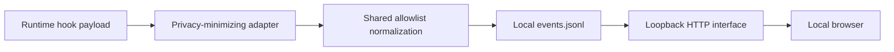

# Privacy and security model

> Version: v0.3.1
> Status: implemented local-first baseline, not a formal security certification

## 1. Security objective

SkillOps should answer operational questions about Skill inventory and lifecycle
while collecting the minimum local metadata needed. A telemetry failure must not
harm the host runtime, and a local dashboard must not silently become a network
collector.

## 2. Trust assumptions

- The local OS user is trusted to access their own Skill/runtime files.
- The SkillOps repository and installed hook scripts have not been tampered with.
- Codex/Claude hook payloads are untrusted input and must be normalized.
- Imported JSON/JSONL is untrusted input.
- Browser clients beyond the local user are not trusted; therefore the HTTP
  interface binds to loopback by default.
- Plugin Skill metadata may be malformed and is treated as data, not executable code.

## 3. Data collected

Depending on available runtime signals, SkillOps may store:

- event, runtime, timestamp, Skill name/version/path;
- session, turn, prompt, tool-use, and subagent identifiers;
- local project basename;
- model/tool/subagent/permission labels;
- duration, reported cost/tokens, and evaluated outcome;
- detection method/confidence;
- prompt/argument lengths;
- definition source/provider/kind/enabled/description/tags.

Source paths and identifiers can still be sensitive local metadata. Treat event
exports and backups as private files.

## 4. Data deliberately not collected

Built-in adapters must not persist:

- raw prompts or Skill arguments;
- transcripts or raw model output;
- tool inputs, tool outputs, or command payloads;
- source-code contents;
- credentials, tokens, cookies, or environment values;
- complete provider/runtime configuration;
- raw payment or personal account data;
- raw error payloads that may embed task content.

The shared event allowlist is a persistence control, not merely a display filter.

## 5. Data flow and storage



There is no built-in cloud upload or account synchronization in v0.3.1.

## 6. Local HTTP exposure

Production defaults:

```text
host: 127.0.0.1
port: 4173
authentication: none
```

Vite development mode also binds to `127.0.0.1` through the package command.

Because the interface can read, append, import, and clear local events, changing
the bind address without authentication creates a material data-integrity and
privacy risk. Non-loopback deployment is outside the supported security model.

## 7. Input validation controls

### Event interface

- explicit event/runtime/outcome/source/kind/detection enums;
- required Skill ID for Skill events;
- ISO-parsable timestamps;
- finite numeric telemetry;
- typed string/boolean/tag fields;
- unknown-field discard;
- contradictory outcome rejection.

### Import

The complete batch is validated before append and revalidated server-side.

### Static serving

Resolved production paths must remain under `dist/`; traversal attempts return
403. Unknown assets return 404 while extensionless application routes fall back
to the SPA.

### Scanner

Traversal is depth-bounded, canonical-path deduplicated, and tolerant of missing
or access-denied conventional directories. Markdown frontmatter is parsed as
text; Skill code is not executed.

## 8. Hook installer safety

Installers must:

- preview before change;
- redact existing environment and credential-like settings in output;
- parse existing JSON rather than replace it blindly;
- preserve unrelated settings and handlers;
- create timestamped backups before changing existing files;
- identify SkillOps handlers with stable markers;
- be idempotent;
- remove only marked handlers during uninstall.

An Installed connection additionally verifies referenced hook scripts still
exist, reducing stale-command risk after repository moves.

## 9. Availability and failure isolation

- Runtime hooks swallow adapter failures so host work continues.
- Diagnostics are local and separate from normalized events.
- Readers tolerate one partial JSONL line.
- Discovery locks have stale-lock recovery.
- Clear/compaction rewrites use temporary files and atomic rename.
- Material event removal creates a backup by default.

These controls reduce failure impact but do not replace filesystem backups.

## 10. Retention and user control

Implemented:

- JSONL export;
- clear with timestamped backup;
- alternate data directory;
- adapter uninstall;
- ignored runtime data in Git.

Limitations:

- no automatic retention window;
- no encrypted-at-rest store managed by SkillOps;
- no automatic backup deletion;
- no per-event deletion in the UI;
- no access control beyond OS permissions and loopback binding.

Operators should protect `data/`, exported JSONL, and backups with appropriate OS
permissions and disk-encryption policy.

## 11. Threat review

| Threat | Current mitigation | Residual limitation |
| --- | --- | --- |
| LAN user reads/clears events | Loopback default | Operator can override host unsafely |
| Malicious imported field captures content | Allowlist + server validation | Allowlisted strings may still contain sensitive caller-supplied text |
| Hook breaks coding workflow | Errors swallowed | Silent telemetry gaps require status/activity checks |
| Installer destroys unrelated config | Merge, markers, backups, idempotency | Manual config corruption remains possible |
| Stale hook path after repository move | Script existence check reports Broken | Runtime may log failed hook attempts until reinstall |
| Plugin symlink loop | Canonical path visited set + depth bound | Very large valid trees can still cost scan time |
| Partial concurrent write | newline repair, locks for discovery | General single-event appends rely on OS append semantics |
| Backup retains deleted history | Explicit local backup | Operator must manage backup lifecycle |

## 12. Privacy review for new fields

Before allowing a field, answer:

1. Which user-visible question requires it?
2. Can a length, enum, hash, basename, or identifier answer instead of content?
3. Can runtime/tool payloads place secrets in the value?
4. Is the value needed persistently or only in memory?
5. Does import/export make the value more portable/sensitive?
6. What rejection and adapter-minimization tests prevent regression?

A generic `payload`, `metadata`, or `context` object is not acceptable as an
escape hatch.

## 13. Operator checklist

- [ ] Keep `SKILLOPS_HOST` on loopback.
- [ ] Review adapter dry-run before install.
- [ ] Trust only commands pointing to the expected repository path.
- [ ] Keep `data/`, exports, and backups out of Git and public shares.
- [ ] Confirm real activity after runtime/provider updates.
- [ ] Reinstall adapters after moving the repository.
- [ ] Review backup retention after clearing data.
- [ ] Do not use manual success outcomes without a trusted evaluator.

## 14. Reporting a security issue

Provide a minimal reproduction and sanitized event/config fragments. Do not
attach real prompts, source, tokens, complete environment output, or unredacted
runtime settings. Until a formal disclosure channel exists, treat the repository
owner as the coordination point and avoid public disclosure of active secrets.
