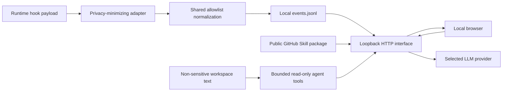

# Privacy and security model

> Version: v0.3.2-rc.1
> Status: implemented local-first baseline, not a formal security certification

## 1. Security objective

SkillOps should answer operational questions about Skill inventory and lifecycle
while collecting the minimum local metadata needed. A telemetry failure must not
harm the host runtime, and a local dashboard must not silently become a network
collector.

## 2. Trust assumptions

- The local OS user is trusted to access their own Skill/runtime files.
- The SkillOps repository and installed hook scripts have not been tampered with.
- Codex/Claude hook payloads are untrusted input and must be normalized.
- Imported JSON/JSONL is untrusted input.
- Browser clients beyond the local user are not trusted; therefore the HTTP
  interface binds to loopback by default.
- Plugin Skill metadata may be malformed and is treated as data, not executable code.
- Public GitHub candidate content and LLM-provider responses are untrusted input.
- A custom HTTPS AI Base URL is trusted by the user to receive the configured
  API key and the explicit evaluation/chat request. Keyless Ollama HTTP is
  restricted to loopback.

## 3. Data collected

Depending on available runtime signals, SkillOps may store:

- event, runtime, timestamp, Skill name/version/path;
- per-install HMAC session pseudonyms plus turn, prompt, tool-use, and subagent identifiers;
- local project basename;
- model/tool/subagent/permission labels;
- duration, reported cost/tokens, and evaluated outcome;
- detection method/confidence;
- prompt/argument lengths;
- definition source/provider/kind/enabled/description/tags.

Source paths and identifiers can still be sensitive local metadata. Treat event
exports and backups as private files.

## 4. Data deliberately not collected

Built-in adapters must not persist:

- raw prompts or Skill arguments;
- transcripts or raw model output;
- tool inputs, tool outputs, or command payloads;
- source-code contents;
- credentials, tokens, cookies, or environment values outside the explicit Skill Lab AI settings file;
- complete provider/runtime configuration outside `data/ai-settings.json`;
- raw payment or personal account data;
- raw error payloads that may embed task content.
- raw host session identifiers (the event store persists only per-install HMAC pseudonyms);

Skill Lab may persist AI provider settings, including API keys, in local
`data/ai-settings.json` after an explicit Save. Evaluation tasks/criteria,
generated answers, judge rationales, chat messages, and workspace excerpts stay
out of persistent SkillOps storage and exist only in browser/request memory for
the current interaction. Credentials are never written to the event store,
exports, diagnostics, or logs. Browser storage is not used for credentials.
When the user selects read-only agent mode, requested allowed workspace excerpts
also exist in request memory and are transmitted to that provider; they are
never appended to SkillOps storage.

Quick Compare keeps this evaluation-content memory-only guarantee when its
engine changes; the explicit AI settings file remains the sole credential
persistence exception.
Managed Suites are explicit, reviewable product files containing only synthetic
or deliberately sanitized cases; they are never derived from runtime telemetry.
The evaluation store persists sanitized run/case status, gates, normalized
Artifact identities, and suite/dataset/policy hashes. Local-scan Artifact
references replace filesystem paths with deterministic SHA-256 pseudonyms.
Provider keys, content bodies, task text, workspace excerpts, raw outputs,
judge responses, and raw errors are not persisted.

The Promptfoo adapter sets its privacy environment before importing the
package, disables cache, telemetry, update checks, sharing, and both normal and
Red Team remote generation, omits output paths, and uses a run-scoped temporary
config directory outside the user's home. The PromptHub connector uses its
documented hosted v1 API only after the user explicitly saves a credential.
The backend stores that credential through the operating-system protection
layer (Windows DPAPI ciphertext under `data/credentials/`, macOS Keychain, or
Linux Secret Service); Git, logs, event/evidence stores, and frontend
persistence receive only configuration status and remote metadata. The Local
Prompt Registry reads Prompt bodies only from exact commits in the configured
user Git repository. The UI, evidence store, Capability registry, and channel
lock receive metadata and hashes, never Prompt bodies.

The Unified Artifact Registry persists only allowlisted metadata. GitHub source
references require a supported HTTPS host, immutable commit, matching encoded
path, and no credentials or query data. Legacy migration rejects unknown input,
runs only after explicit preview/apply calls, and keeps backup bytes local; the
HTTP interface exposes hashes and sanitized records, never backup bytes or
Artifact bodies.

Governance requests do not accept owner, reviewer, or operator IDs from the
browser. The loopback server uses its operating-system principal when no
credential is supplied or maps a Bearer token from the process-only
`SKILLOPS_GOVERNANCE_PRINCIPALS` configuration to a server-defined principal.
The browser keeps a reviewer token only in component memory and clears it after
approval; tokens are never written to Capability, audit, recovery, event, or
frontend persistence. Capability and append-only audit records retain only the
resolved identity plus Artifact/version, stage, evidence hash, and timestamps.
Direct lock and audit API reads require a configured Bearer principal; the
operating-system fallback is not accepted for these metadata-egress routes.
Governed file backups can contain the selected Artifact body, but remain beside
the local managed target, are never returned by the API, and are created only
after explicit preview and confirmation. Server-only recovery metadata stores
paths, hashes, and opaque references in
`SKILLOPS_DATA_DIR/governance-release-recoveries.json`, never backup contents
or credentials. New installations are confined to `SKILLOPS_SKELETON_ROOT`;
existing mutations accept only regular, non-symlink targets from the enabled
scan inventory.

The Team control plane stores local entity metadata, role assignments, policy
exceptions, and SHA-256 device-token hashes, never device-token values. A token
is returned once, has only `collector:write`, and stops authorizing immediately
after revocation. Collector requests remain loopback-only, JSON- and
count-bounded, and persist only the shared runtime-event allowlist plus
capability/version/content/evidence hashes, gate result, and optional numeric
scores. Project names, source paths, errors, prompts, tasks, Artifact bodies,
provider keys, tool input/output, and unknown fields are excluded. Team backup
and export omit token hashes and collector records. Hash-chained audit rows
contain only actor, role, action, subject type/ID, state revision, and time.
Expired collector rows are pruned only by an explicit Owner retention request;
the Team audit remains append-only.

Team Template manifests remain in user-controlled Git. Preview reads target
files only to compute local hashes and line counts; it does not log or persist
their bodies. `.skillops/team-template.lock.json` stores template/Artifact
versions, Git references, hashes, approval IDs, sanitized Suite run IDs, and a
previous-Stable commit only. Template bodies remain ordinary project files and
Git blobs. Upgrade evaluation uses the existing isolated Promptfoo boundary,
and `skillops init` rejects API keys supplied directly on the command line.
Failed gates write nothing. File-transaction backups are random, target-adjacent
temporary files removed before return and are never copied to SkillOps data,
Team exports, telemetry, or API responses.

The shared event allowlist is a persistence control, not merely a display filter.

## 5. Data flow and storage



There is no background cloud upload, telemetry export, or account
synchronization. The GitHub and provider arrows are explicit Skill Lab actions,
not runtime collection. Prompt-only evaluation and assistant chat do not read
local workspace contents. Read-only agent mode exposes only bounded allowlisted
tools, and the loopback backend performs provider calls so local files remain
behind that explicit interface.
GitHub Candidate packages remain memory-only: the backend downloads regular files
under the selected `SKILL.md` directory, enforces the 500-file / 10 MB package
limits, and returns only derived metadata to the browser.

## 6. Local HTTP exposure

Production defaults:

```text
host: 127.0.0.1
port: 4173
authentication: none
```

Vite development mode also binds to `127.0.0.1` through the package command.

Because the interface can read, append, import, and clear local events, changing
the bind address without authentication creates a material data-integrity and
privacy risk. Non-loopback deployment is outside the supported security model.
Core, evaluation, and chat handlers validate the loopback socket and Host and
reject cross-site or mismatched browser Origins before reading or mutating local
state. Event/import and evaluation/chat JSON requests require
`application/json`; evaluation/chat responses also disable caching and apply
`nosniff`.

## 7. Input validation controls

### Event interface

- explicit event/runtime/outcome/source/kind/detection enums;
- required Skill ID for Skill events;
- ISO-parsable timestamps;
- finite numeric telemetry;
- typed string/boolean/tag fields;
- unknown-field discard;
- contradictory outcome rejection.

### Import

The complete batch is validated before append and revalidated server-side.

### Static serving

Resolved production paths must remain under `dist/`; traversal attempts return
403. Unknown assets return 404 while extensionless application routes fall back
to the SPA.

### Scanner

Traversal is depth-bounded, canonical-path deduplicated, and tolerant of missing
or access-denied conventional directories. Markdown frontmatter is parsed as
text; Skill code is not executed.

### Candidate discovery

- accepts HTTPS `github.com` or `raw.githubusercontent.com` only;
- requires `SKILL.md` for direct raw/blob links;
- rejects truncated repository trees;
- caps discovered entries at 40 and one downloaded definition at 256 KB;
- treats remote Markdown as text and never executes it.

### Evaluation and assistant

- an A/B baseline path must match the exact path from a current enabled scan;
- the candidate SHA-256 content hash must still match its analysis response;
- request bodies, task, criteria, provider fields, message count, nested context, and string lengths are bounded;
- assistant context excludes local paths and local Skill file contents;
- Answer A/B ordering is stable-blinded before judging;
- a judge winner that contradicts its normalized scores is rejected;
- credentials are not echoed in success payloads or persisted error records;
- credentialed custom Base URLs require HTTPS and reject embedded credentials,
  query strings, and fragments; keyless Ollama HTTP must use loopback;
- remote candidate and provider response bodies are byte-bounded while streaming.

Read-only agent mode has an additional capability boundary:

- tools are limited to list, literal search, and read of bounded workspace text;
- hidden names, credential/key names, `data/`, `.opc`, VCS data, dependencies, caches,
  coverage, and build output are blocked;
- lines containing common credential labels are redacted before matching or return;
- absolute paths, traversal, symlinks, unsupported file types, oversized files,
  excess results, excess model rounds, and excess tool calls are rejected;
- no write, delete, process execution, arbitrary network, or runtime-config tool exists.

## 8. Hook installer safety

Installers must:

- preview before change;
- redact existing environment and credential-like settings in output;
- parse existing JSON rather than replace it blindly;
- preserve unrelated settings and handlers;
- create timestamped backups before changing existing files;
- identify SkillOps handlers with stable markers;
- be idempotent;
- remove only marked handlers during uninstall.

An Installed connection additionally verifies referenced hook scripts still
exist, reducing stale-command risk after repository moves.

## 9. Availability and failure isolation

- Runtime hooks swallow adapter failures so host work continues.
- Diagnostics are local and separate from normalized events.
- Readers tolerate one partial JSONL line.
- Discovery locks have stale-lock recovery.
- Clear/compaction rewrites use temporary files and atomic rename.
- Material event removal creates a backup by default.

These controls reduce failure impact but do not replace filesystem backups.

## 10. Retention and user control

Implemented:

- JSONL export;
- clear with timestamped backup;
- alternate data directory;
- adapter uninstall;
- ignored runtime data in Git.

Limitations:

- no automatic retention window;
- no encrypted-at-rest store managed by SkillOps;
- no automatic backup deletion;
- no per-event deletion in the UI;
- no access control beyond OS permissions and loopback binding.

Operators should protect `data/`, exported JSONL, and backups with appropriate OS
permissions and disk-encryption policy.

## 11. Threat review

| Threat | Current mitigation | Residual limitation |
| --- | --- | --- |
| LAN user reads/clears events | Loopback default | Operator can override host unsafely |
| Malicious imported field captures content | Allowlist + server validation | Allowlisted strings may still contain sensitive caller-supplied text |
| Hook breaks coding workflow | Errors swallowed | Silent telemetry gaps require status/activity checks |
| Installer destroys unrelated config | Merge, markers, backups, idempotency | Manual config corruption remains possible |
| Stale hook path after repository move | Script existence check reports Broken | Runtime may log failed hook attempts until reinstall |
| Plugin symlink loop | Canonical path visited set + depth bound | Very large valid trees can still cost scan time |
| Partial concurrent write | newline repair, locks for discovery | General single-event appends rely on OS append semantics |
| Backup retains deleted history | Explicit local backup | Operator must manage backup lifecycle |
| Malicious candidate causes oversized/network work | GitHub-only URL allowlist, tree/file bounds, timeout | Public GitHub content can still contain adversarial instructions evaluated by the selected model |
| DNS rebinding/cross-site page invokes evaluation API | Loopback Host, same-origin browser checks, JSON-only POST | Non-browser local processes under the same OS user remain trusted |
| Custom endpoint steals API key | HTTPS requirement, no embedded credentials, UI warning, local-only settings file | User must trust the endpoint they configure and protect the local data directory |
| Agent exposes sensitive workspace data | Explicit mode, denied paths/types, credential-line redaction, bounded read-only tools, negative privacy tests | Allowed source can still embed sensitive data and excerpts are intentionally disclosed to the selected provider |
| Evaluation content persists accidentally | Sanitized evidence allowlist, separate store, recovery tests; event allowlist unchanged | Browser/provider retention follows their own policies |
| Raw host session IDs link activity outside SkillOps | Event-store HMAC pseudonymization with a random per-install key | Events remain intentionally linkable within one installation; protect `session-identity.key` with the rest of `data/` |
| Promptfoo writes cache/history, sends telemetry, or spawns a network client | Adapter flags, isolated temporary config, disk sentinels, default-deny test child processes, and inherited guards for nested Node processes | Environment/process guards are defense in depth, not an operating-system network sandbox; package upgrades require contract revalidation |
| A branch or working tree silently replaces a Prompt release | Commit-pinned source references plus semantic/component hashes and pre-run/pre-promotion recheck | Deleted or rewritten Git objects can make old content unavailable, but Stable metadata and lock rollback remain local |
| LLM judge creates false confidence | Blind A/B labels and task-specific wording | One model judgment is evidence for one case, not universal quality |

## 12. Privacy review for new fields

Before allowing a field, answer:

1. Which user-visible question requires it?
2. Can a length, enum, hash, basename, or identifier answer instead of content?
3. Can runtime/tool payloads place secrets in the value?
4. Is the value needed persistently or only in memory?
5. Does import/export make the value more portable/sensitive?
6. What rejection and adapter-minimization tests prevent regression?

A generic `payload`, `metadata`, or `context` object is not acceptable as an
escape hatch.

## 13. Operator checklist

- [ ] Keep `SKILLOPS_HOST` on loopback.
- [ ] Review adapter dry-run before install.
- [ ] Trust only commands pointing to the expected repository path.
- [ ] Keep `data/`, exports, and backups out of Git and public shares.
- [ ] Protect `session-identity.key` with the same OS permissions and disk-encryption policy as `data/`.
- [ ] Confirm real activity after runtime/provider updates.
- [ ] Reinstall adapters after moving the repository.
- [ ] Review backup retention after clearing data.
- [ ] Do not use manual success outcomes without a trusted evaluator.
- [ ] Use only trusted AI Base URLs and review the selected provider's data policy.
- [ ] Avoid placing secrets or proprietary source in Skill Lab tasks or chat.
- [ ] Use prompt-only mode when workspace excerpts must not leave the machine.

## 14. Reporting a security issue

Provide a minimal reproduction and sanitized event/config fragments. Do not
attach real prompts, source, tokens, complete environment output, or unredacted
runtime settings. Until a formal disclosure channel exists, treat the repository
owner as the coordination point and avoid public disclosure of active secrets.
